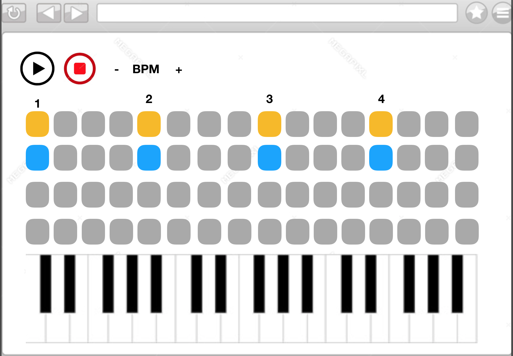

<h1 align='center'>
  Rhythm Is A Maker.
</h1>

|   **Team Collaborators**   |  **Github Profile**                      |
| :---:        |   :---:                                  |
|Scott Hall    | <a href='https://github.com/HottScall'></a>     |
|Frankie Bamgboye | <a href='https://github.com/FrankieBoye'></a>|
|Michael Darmody  | <a href='https://github.com/Michael-Darmody'></a>|
|Steven Hektor | <a href='https://github.com/shektor'></a>|
|Sarpong Abasimi | <a href='https://github.com/SarpongAbasimi'></a>|

<h4 align='center'>
How To Use Application.
</h4>

- ``Fork`` and ``clone`` this repo.
- ``Open`` terminal and ``cd`` into ``rhythms-is-a-maker``.
- In terminal, type ``npm install`` to install dependencies.
- To run ``test`` type ``npm test``.
- To run server type ``npm run dev``.
- click on this **[link](http://localhost:3000/)**.


<h4 align='center'>
User stories - Features.
</h4>

```
As a User,
So that I can make music,
I would like to be able to make sounds on the web.
```

<h4 align='center'>
How Tone.Js Works 
</h4>

- To Learn about ``tone.js`` => **[here](https://tonejs.github.io)**.
- Tone.js is a framework for creating ``interactive`` music in the browser.
- Here is how sounds are generated.

 ```javascript 
var synth = new Tone.Synth().toMaster()
synth.triggerAttackRelease('C4', '8n')
```
> This creates a new instance of Tone and stores it into a variable called ``synth``. The ``.toMaster()`` connects the sound to the speakers on your device and lastly, to make a sound we use a method called ``triggerAttackRelease('C4', '8n')``.

```TriggerAttackRelease is a combination of two methods: triggerAttack when the amplitude is rising (for example from a ‘key down’ or ‘note on’ event), and triggerRelease is when the amplitude is going back to 0 (‘key up’ / ‘note off’).```


<h4 align='center'>
App Goal.
</h4>




|      TECH STACK                   |
|    :------:                       |
|Express.js \| Tone.js \| Travis CI |
   